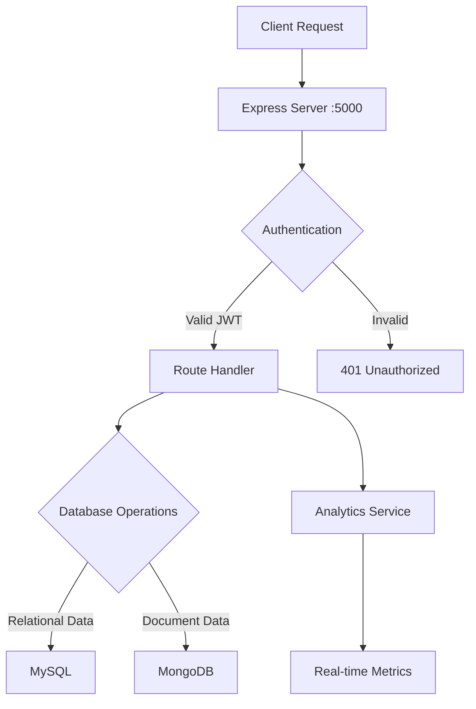
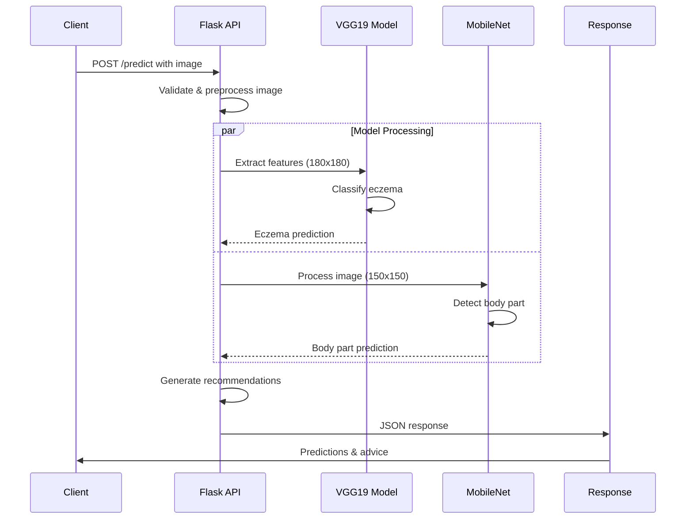
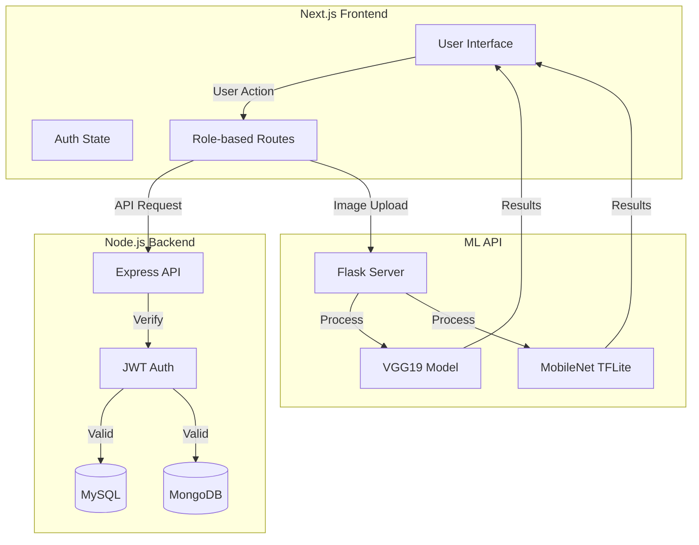

# ECZEMA DIAGNOSIS AND MANAGEMENT SYSTEM

By
GROUP NO. XX
INTERNET SYSTEMS TRACK
DEPARTMENT OF COMPUTER SCIENCE
SCHOOL OF COMPUTING AND INFORMATICS TECHNOLOGY

A Project Report Submitted to the School of Computing and Informatics Technology 
for the Study Leading to a Project in Partial Fulfillment of the 
Requirements for the Award of the Degree of Bachelor of 
Science in Software Engineering of Makerere University.

Supervisor
[Supervisor Name]
Department of Computer Science
School of Computing and Informatics Technology, Makerere University
[Supervisor Email], +256-41-540628, Fax: +256-41-540620

May, 2025

## Declaration

We, group XX, hereby declare that the work presented is original and has never been submitted for an award to any university or institution of higher learning. We can confirm that where we have done consultations either from published material or the works of others, it has been attributed in this report.

| # | Names | Registration Number | Signature |
|---|-------|-------------------|------------|
| 1 |       |                   |            |
| 2 |       |                   |            |
| 3 |       |                   |            |
| 4 |       |                   |            |

## Approval

This project report titled "Eczema Diagnosis and Management System" has been submitted for examination with my approval as the supervisor of group XX.

[Supervisor Name]
Department of Computer Science
School of Computing and Informatics Technology
College of Computing and Information Sciences
Makerere University

Signature: ................................................... Date: ............................

## Dedication

[Dedication text]

## Acknowledgements

[Acknowledgements text]

## Abstract

The Eczema Diagnosis and Management System is a comprehensive healthcare platform that integrates artificial intelligence, web technologies, and database systems to revolutionize dermatological care. The system employs a three-tier architecture consisting of a Next.js frontend, Node.js backend, and Flask-based ML API, enabling automated diagnosis, patient monitoring, and healthcare provider collaboration. This project demonstrates the practical application of modern software engineering principles in healthcare, showcasing real-time processing, secure data management, and AI-driven medical diagnosis.

## Table of Contents

1. [Introduction](#chapter-1-introduction)
2. [System Specifications](#chapter-2-system-specifications)
3. [Design Output](#chapter-3-design-output)
4. [Inspection and Testing](#chapter-4-inspection-and-testing)
5. [Installation and System Acceptance Test](#chapter-5-installation-and-system-acceptance-test)
6. [Performance, Servicing, and Maintenance](#chapter-6-performance-servicing-maintenance-and-phase-out)
7. [Conclusion and Recommendations](#chapter-7-conclusion-and-recommendations)

## List of Figures

1. Backend Architecture Diagram
2. ML API Sequence Diagram
3. System Integration Flowchart
4. Database Schema Diagram

## List of Tables

1. System Requirements
2. API Endpoints
3. Test Cases
4. Installation Checklist

## Abbreviations/Acronyms

- AI: Artificial Intelligence
- API: Application Programming Interface
- JWT: JSON Web Token
- ML: Machine Learning
- RBAC: Role-Based Access Control
- REST: Representational State Transfer

# Chapter 1: Introduction

The Eczema Diagnosis and Management System is a full-stack, AI-powered platform designed to revolutionize the diagnosis, monitoring, and management of eczema and related dermatological conditions. The system seamlessly integrates a robust Node.js backend, a modern Next.js frontend, and a dedicated machine learning API for image-based diagnosis. This essay-style report provides a detailed, holistic analysis of all three codebases, exploring their architecture, modules, security, data flow, and unique features, as well as how they interconnect to deliver a unified healthcare solution.

## 1.1 Background and Scope of the Project

Eczema affects approximately 15-20% of children and 1-3% of adults worldwide, making accurate diagnosis and management crucial for healthcare providers. Traditional diagnosis methods often involve physical consultations, which can be time-consuming and may not be readily accessible to all patients. This project aims to leverage modern technology to create a comprehensive system that enables remote diagnosis, monitoring, and management of eczema conditions.

## 1.2 Overview of the Document

This document describes the implementation, testing, and validation findings for the Eczema Diagnosis and Management System. It is structured to provide a complete understanding of the system's architecture, functionality, and deployment process.

# Chapter 2: System Specifications

## 2.1 Version Control and Requirements

### Version Control System
- Git for source code management
- GitHub for collaborative development
- Semantic versioning (MAJOR.MINOR.PATCH)

Version History:
- v1.0.0: Initial release with core functionality
- v1.1.0: Added ML-based diagnosis
- v1.2.0: Enhanced analytics and reporting

## 2.2 Input Specifications

1. **Image Input**
   - Format: JPEG, PNG
   - Size: Maximum 10MB
   - Resolution: Minimum 300x300 pixels
   - Color space: RGB

2. **User Data**
   - Registration information
   - Medical history
   - Treatment records

3. **System Configuration**
   - Environment variables
   - API endpoints
   - Security parameters

## 2.3 Output Specifications

1. **Diagnostic Results**
   - Condition classification
   - Confidence scores
   - Treatment recommendations

2. **Analytics Reports**
   - User statistics
   - System performance metrics
   - Diagnostic accuracy reports

3. **User Interface**
   - Role-specific dashboards
   - Interactive visualizations
   - Real-time notifications

## 2.4 Functionality

### Core Features

## 2.5 Limitations and Safety

### System Limitations and Safety Measures

The Eczema Diagnosis and Management System operates within specific technical constraints to ensure reliable performance and data security. The system's functionality is fundamentally dependent on network connectivity, requiring a stable internet connection with a minimum bandwidth of 1 Mbps to support essential features such as image uploads and real-time communications. The WebSocket-based notification system and chat features particularly demand consistent network stability to maintain seamless real-time interactions between healthcare providers and patients.

From a client-side perspective, the system requires modern web browsers with JavaScript enabled to ensure proper functionality. The image processing capabilities, which are crucial for accurate eczema diagnosis, rely on WebGL support for efficient client-side computations. Additionally, the system utilizes local storage for session management and temporary data caching, making this browser feature mandatory for optimal user experience.

To maintain system performance and ensure efficient resource utilization, several storage limitations are implemented. Image uploads are restricted to 10MB per file, striking a balance between image quality requirements for accurate diagnosis and system resource management. Patient history records are maintained for 24 months, providing sufficient historical data for treatment tracking while managing database growth. Chat histories are retained for six months to support ongoing patient-doctor communications while preventing excessive storage consumption.

The system implements robust safety measures to protect data integrity and user privacy. A comprehensive input validation system ensures that all uploaded images meet the required quality standards for accurate diagnosis, checking resolution, clarity, and format compliance. Patient data entry is strictly controlled, requiring complete medical history information to prevent incomplete or inaccurate records. Healthcare providers must undergo a thorough verification process, including medical license validation, before gaining system access.

Data protection measures include automated session management, with inactive sessions timing out after 30 minutes to prevent unauthorized access. The system employs rate limiting on API endpoints to prevent abuse and maintain service stability. To ensure data privacy and session integrity, users are restricted to maintaining only one active session at a time, preventing potential security risks from multiple concurrent logins.

## 2.6 Default Settings

### System Configuration and Default Settings

The Eczema Diagnosis and Management System is initialized with carefully configured default settings designed to ensure immediate functionality while maintaining security. Upon initial deployment, the system creates a primary administrator account (admin@eczema-system.com) with a secure default password. To maintain security, the system enforces an immediate password change during the administrator's first login through the Security Settings interface, establishing a crucial security baseline for system management.

The system's default configuration establishes English as the primary interface language, with all timestamps standardized to UTC to ensure consistent time-based operations across different geographical locations. Date formatting follows the ISO standard (YYYY-MM-DD) to maintain uniformity in data presentation and storage. The image processing subsystem is initially set to a medium quality threshold, offering a balanced compromise between processing speed and diagnostic accuracy, though this can be adjusted based on specific deployment requirements.

Notification systems are preconfigured to optimize communication while preventing alert fatigue. Email and in-app notifications are enabled by default, providing essential system alerts and diagnostic information. SMS notifications are initially disabled but can be activated based on institutional requirements. Diagnostic alerts are specifically enabled for healthcare providers, ensuring they receive immediate updates about patient conditions and test results.

The system implements a role-based access control system with two primary user types: doctors and patients. Healthcare providers are granted comprehensive access to patient management tools, including the ability to view assigned patients, utilize diagnostic tools, generate detailed reports, and engage in direct patient communication. Patient accounts are configured with more focused permissions, allowing them to upload diagnostic images, access their medical history, schedule appointments, and communicate with their assigned healthcare providers. This careful segregation of permissions ensures data privacy while maintaining necessary functionality for each user type.

## 2.7 Special Requirements

### Special Requirements and Security Measures

The Eczema Diagnosis and Management System adheres to stringent security requirements and regulatory compliance standards to protect sensitive medical data. At its core, the system maintains full HIPAA compliance for all patient-related data handling, implementing end-to-end encryption for all communications, including real-time chat messages between healthcare providers and patients. All data transmissions are secured through SSL/TLS connections, with regular security audits conducted to identify and address potential vulnerabilities.

Data integrity and availability are ensured through a comprehensive backup and recovery system. The system performs automated daily backups of all databases, with the backup data stored in encrypted format to maintain security even in offline storage. A 30-day backup retention policy provides adequate historical data access while managing storage requirements efficiently. The disaster recovery plan guarantees a maximum recovery time objective (RTO) of 4 hours, ensuring minimal disruption to healthcare services in case of system failures.

Access control is implemented through multiple security layers. Administrative access requires multi-factor authentication, adding an extra security layer beyond traditional password protection. The admin panel is further secured through IP-based access restrictions, limiting administrative functions to authorized networks. A comprehensive role-based access control (RBAC) system governs all user interactions, with detailed audit logging tracking every system access and modification.

### Error Management and Alert Systems

The system implements a sophisticated error handling and notification framework to maintain stability and user experience. Authentication-related issues are managed through a progressive security system: users are allowed three login attempts before a temporary account lockout is triggered, expired sessions are handled through graceful redirects to the login page, and invalid tokens result in automatic logouts with clear user notifications.

Image processing, crucial for the system's diagnostic capabilities, includes robust error handling mechanisms. When users upload low-quality images, the system provides immediate feedback and prompts for new uploads. Processing failures are managed through a three-attempt retry mechanism, while model timeouts trigger notifications with retry options, ensuring diagnostic accuracy is never compromised by technical issues.

Database operations are protected by comprehensive error handling protocols. Connection timeouts trigger automatic reconnection attempts, failed queries initiate transaction rollbacks to maintain data consistency, and duplicate entry attempts are gracefully handled through unique constraint violation management.

The alert system employs a tiered notification approach based on severity. Critical alerts are displayed with prominent red banners accompanied by audio cues, warnings use yellow banners for moderate-priority issues, and informational messages appear as subtle blue toast notifications. Administrative alerts cover system-wide concerns including performance degradation, elevated error rates, database connectivity issues, and potential security breaches.

Error recovery processes are automated where possible, beginning with systematic error logging and classification. The system prioritizes incidents based on severity and impact, with real-time reporting to the admin dashboard. Automated recovery procedures are implemented for common issues, while more complex problems trigger escalation protocols for human intervention. This comprehensive approach ensures system reliability while minimizing downtime and maintaining service quality.

The backend codebase, located at `C:\Users\vc\Desktop\backend`, is the backbone of the system, orchestrating authentication, data management, analytics, and secure communication between users and services.



### System Architecture Overview

```plaintext
├── API Layer (/api)
│   ├── Authentication (/auth)
│   │   ├── /login - JWT generation
│   │   └── /refresh - Token refresh
│   ├── Analytics (/analytics)
│   │   ├── /total-users
│   │   ├── /system-uptime
│   │   ├── /active-sessions
│   │   ├── /error-rate
│   │   ├── /recent-activity
│   │   ├── /alerts
│   │   └── /diagnoses-count
│   └── Core Features
│       ├── /appointments
│       ├── /diagnoses
│       └── /messages
├── Database Layer
│   ├── MySQL (Relational Data)
│   │   ├── users
│   │   ├── patients
│   │   └── appointments
│   └── MongoDB (Document Data)
│       ├── diagnoses
│       ├── analytics
│       └── messages
└── Service Layer
    ├── Authentication
    ├── Analytics
    └── Notifications
```

### Architecture & Structure

- **Core Entry Point**: `server.js` initializes the Express server, configures middleware, connects to both MySQL and MongoDB, and sets up the API routes.
- **Controllers**: The `controllers/` directory implements business logic for authentication, appointments, analytics, eczema diagnosis, messaging, and more. Each controller is focused, modular, and mapped to specific routes.
- **Routes**: The `routes/` folder defines RESTful endpoints under `/api`, including `auth.js`, `analytics.js`, `appointments.js`, `doctors.js`, `eczema.js`, `messages.js`, `research.js`, and `users.js`. Each route is protected by authentication and role-based middleware.
- **Models**: The `models/` directory houses ORM models for both MySQL (relational data: users, patients, appointments) and MongoDB (flexible data: diagnoses, messages, analytics, advisory, conversations). Sequelize is used for MySQL, while Mongoose or native drivers are likely used for MongoDB.
- **Middleware**: Security and robustness are enhanced by middleware for authentication (`auth.js`), error handling, logging, rate limiting, and file uploads. These ensure only authorized users access sensitive data, and that the system is resilient to abuse.
- **Services**: The `services/` layer abstracts complex logic such as analytics computation, notifications, research data handling, and real-time socket communication.
- **Configuration**: Environment variables, database configs, and storage settings are managed in `config/`, with `.env` files for secrets and deployment flexibility.
- **Database Migrations**: The `migrations/` folder and `MIGRATIONS.md` document schema evolution, ensuring data integrity and traceability.
- **Testing & Documentation**: `tests/` and `postman/` provide API test suites, while `docs/` contains technical documentation and sequence diagrams for maintainability.
- **Utilities**: Helper functions in `utils/` and scripts in `scripts/` support automation and code reuse.

### Security & Authentication

- **JWT-Based Auth**: Every API request is authenticated via JWT tokens, with user ID and role encoded. Tokens are stored in both headers and cookies for secure session management.
- **Role-Based Access Control (RBAC)**: Middleware enforces permissions for admin, doctor, researcher, and patient roles, restricting analytics and sensitive endpoints to authorized users only.
- **CORS**: Strict CORS policies allow only the trusted frontend domain to interact with the API.
- **Input Validation**: All inputs are sanitized and validated to prevent injection attacks and ensure data quality.
- **Logging & Error Handling**: Centralized error handling and detailed logs (`combined.log`, `error.log`) aid in monitoring and incident response.

### Analytics & Monitoring

- **Comprehensive Analytics**: Endpoints under `/api/analytics` provide real-time insights into system health, user activity, error rates, active sessions, and diagnosis statistics.
- **System Uptime & Alerts**: The backend tracks uptime and can issue maintenance alerts, supporting proactive system administration.

### Data Flow & Integration

- **Dual Database Design**: MySQL is used for structured, relational data (users, patients, appointments), while MongoDB stores flexible, unstructured data (diagnoses, messages, analytics events), allowing for both transactional integrity and scalability.
- **API-First Approach**: The backend exposes a clean, RESTful API consumed by both the frontend and the ML API, enabling modularity and future extensibility.
- **Health Checks**: `/health` endpoint ensures system readiness and uptime.

### Unique Features & Strengths

- **Separation of Concerns**: Clear modularization between controllers, services, models, and routes.
- **Scalability**: Dual database architecture supports both transactional and analytical workloads.
- **Security**: Strong authentication, RBAC, and regular audits.
- **Extensibility**: Well-documented API and service abstraction allow for easy addition of new features.

---

---

## Frontend (Next.js, React, TypeScript)

The frontend, located at `C:\Users\vc\Desktop\eczema-dashboard`, is the user-facing component of the system, delivering an intuitive, responsive, and role-aware interface for all stakeholders: patients, doctors, researchers, and administrators.

### Architecture & Structure

- **App Directory Structure**: The `app/` directory leverages Next.js’s App Router for file-based routing, supporting layouts and nested routes for different user roles. Subfolders such as `(admin)`, `(doctor)`, `(patient)`, and `(auth)` provide clear separation of concerns and enable tailored experiences for each role.
- **Components**: The `components/` directory is highly modular, with hundreds of reusable React components for analytics, appointments, dashboards, authentication, messaging, and more. This modularity accelerates development and ensures UI consistency.
- **State Management**: State is managed using React’s built-in hooks, and potentially context or third-party libraries for global state (notably for authentication and user session management). Data fetching is handled via server-side functions or API calls, ensuring up-to-date information.
- **Styling**: The system uses Tailwind CSS for utility-first, responsive design, with custom styles in `styles/` and global settings in `tailwind.config.js`. This ensures a modern, clean, and accessible UI across devices.
- **Configuration & Middleware**: Environment variables, Next.js config files, and `middleware.ts` enable secure API communication, route protection, and seamless integration with backend services.
- **Documentation & Public Assets**: The `docs/` and `public/` directories provide user guides, screenshots, and static assets (e.g., logos, images).

### Routing & Role-Based Access

- **Dynamic Routing**: The app uses dynamic and nested routes for user-specific pages (e.g., `/doctor/patients/[id]`), supporting deep linking and direct access to patient records or analytics.
- **Role-Based Layouts**: Each user role has a dedicated layout and navigation structure, ensuring that admins, doctors, patients, and researchers see only the features relevant to them.
- **Protected Routes**: Middleware and client-side guards ensure that only authenticated users can access sensitive pages, enforcing security and privacy.

### User Experience & Features

- **Dashboards**: Each role has a custom dashboard (admin, doctor, patient), summarizing key analytics, appointments, recent activity, and actionable insights.
- **Analytics & Monitoring**: Admins and doctors have access to rich analytics pages, visualizing user activity, system health, diagnosis statistics, and more, often using charts and real-time updates.
- **Appointments & Messaging**: Patients can schedule appointments, view doctor recommendations, and communicate securely with healthcare providers via real-time messaging components.
- **Diagnosis & Treatment**: Doctors can upload images, review ML-powered diagnosis results, and manage treatment plans directly from the interface.
- **Accessibility & Responsiveness**: The UI is fully responsive and accessible, ensuring usability across devices and for users with varying needs.

### Integration & API Communication

- **API Consumption**: The frontend interacts with the backend via RESTful APIs, handling authentication tokens, role information, and session cookies securely.
- **ML API Integration**: Image uploads for diagnosis are sent to the ML API, and results (eczema detection, body part, severity, recommendations) are displayed in real-time to users.
- **Error Handling**: User-friendly error messages and loading states ensure a smooth experience, even in cases of network issues or backend errors.

### Unique Features & Strengths

- **Role-Aware Design**: Deep integration of RBAC into the UI, ensuring clarity and security for all user types.
- **Extensive Component Library**: Highly reusable, well-organized components speed up development and facilitate future enhancements.
- **Modern UX**: Clean, modern design with a focus on usability, accessibility, and performance.
- **Seamless Integration**: Tight coupling with backend and ML API, providing a unified, data-driven experience.

---

---

## ML API (Flask, TensorFlow, VGG19/MobileNet, TFLite)

The ML API, located at `D:\ml_api`, is the intelligent diagnostic engine of the Eczema Diagnosis and Management System. It leverages deep learning to provide automated, accurate, and explainable eczema detection and severity assessment from user-uploaded skin images.



### Model Architecture

```plaintext
VGG19 Pipeline:
└── Input Image (180x180x3)
    ├── VGG19 Base (Feature Extraction)
    │   └── Frozen pre-trained weights
    ├── Custom Layers
    │   ├── Dense (512 units, ReLU)
    │   ├── Dropout (0.5)
    │   └── Output (6 classes, Softmax)
    └── Classes:
        ├── Eczema
        ├── Acne and Rosacea
        ├── Normal
        ├── Vitiligo
        ├── Fungal Infections
        └── Melanoma

MobileNet Pipeline (TFLite):
└── Input Image (150x150x3)
    ├── Quantized MobileNet
    └── Output (10 body parts)
```

### Architecture & Structure

- **Core Application**: The main application logic resides in `main.py`, implemented using Flask for lightweight, RESTful API serving. The API is CORS-enabled to allow secure communication with the frontend and backend.
- **Model Assets**: Two primary models are used:
  - `eczema.h5`: A custom-trained Keras model for eczema and skin condition classification, using features extracted from a VGG19 backbone.
  - `mobilenet_bodypart_model_quantized.tflite`: A quantized MobileNet model for identifying the body part depicted in the image, optimized for inference speed and resource efficiency.
- **Endpoints**:
  - `/predict`: Accepts image uploads, processes them through both models, and returns a JSON response with predictions (eczema label, confidence, severity, body part, recommendations, and skincare tips).
  - `/health`: A health check endpoint for monitoring API readiness.
- **Preprocessing Pipeline**: Includes image resizing, normalization, and conversion to the appropriate format for each model (180x180 for VGG19, 150x150 for MobileNet).
- **Supporting Files**: `requirements.txt` specifies dependencies (Flask, TensorFlow, Pillow, NumPy, etc.), and `Dockerfile` enables containerized deployment for scalability and reproducibility. `test_api.py` provides test coverage for API endpoints.

### Prediction Logic & Output

- **Image Processing**: Uploaded images are preprocessed and passed through VGG19 for feature extraction, followed by the custom eczema classifier for disease prediction.
- **Body Part Detection**: Simultaneously, the image is processed by the quantized MobileNet model to identify the anatomical region, which is important for context-aware recommendations.
- **Severity Assessment**: Based on the confidence score of the eczema prediction, the system assigns a severity level (Mild, Moderate, Severe).
- **Personalized Recommendations**: If eczema is detected, the API returns tailored treatment recommendations; if not, it provides general skincare tips.
- **Performance Monitoring**: The API logs processing times for each stage, supporting future optimization and transparency.

### Security & Deployment

- **CORS & Input Validation**: Only trusted origins can access the API, and all image inputs are validated for type and size.
- **Containerization**: The Dockerfile ensures consistent deployment across environments, and dependencies are tightly controlled for reproducibility.
- **Health Monitoring**: The `/health` endpoint enables automated readiness checks for integration into larger orchestrated deployments.

### Unique Features & Strengths

- **Dual-Model Pipeline**: Combines disease detection and anatomical localization for richer, more actionable outputs.
- **Explainability**: Confidence scores and severity mapping provide transparency to users and clinicians.
- **Performance**: Quantized models and efficient preprocessing ensure rapid response times suitable for real-time applications.
- **Extensibility**: Modular design allows for easy retraining, replacement, or expansion of models as new data becomes available.

---

## Full System Integration & Data Flow

The three codebases are tightly integrated, forming a seamless, secure, and scalable healthcare platform:



### Authentication Flow

```plaintext
1. User Login:
   POST /api/auth/login
   ├── Validate credentials
   ├── Generate JWT
   └── Set secure cookies

2. API Requests:
   ├── Extract token from Authorization header
   ├── Verify JWT signature
   ├── Check user role permissions
   └── Process request if authorized

3. ML API Access:
   ├── Frontend sends image with JWT
   ├── ML API validates origin
   └── Returns predictions
```

- **Authentication & Security**: Users authenticate via the backend, which manages sessions and role-based access. Tokens are securely transmitted and validated across frontend, backend, and ML API requests.
- **User Experience**: The frontend provides role-specific dashboards and workflows, abstracting away backend and ML complexity while surfacing actionable insights and recommendations.
- **Diagnosis Workflow**: When a user uploads an image for diagnosis, the frontend sends it to the ML API, receives structured predictions, and displays results alongside treatment options and analytics.
- **Analytics & Monitoring**: The backend aggregates data from user activity, diagnoses, and system events, powering real-time analytics dashboards for admins and clinicians.
- **Resilience & Observability**: Health check endpoints, logging, and error handling across all services ensure system reliability and facilitate rapid troubleshooting.

---

## Conclusion

The Eczema Diagnosis and Management System exemplifies a modern, integrated approach to digital healthcare. Its modular architecture—spanning a robust Node.js backend, a feature-rich Next.js frontend, and a cutting-edge ML API—delivers a secure, scalable, and user-centric platform for eczema care. The system’s strengths lie in its:

- Deep role-based access control and security
- Dual-database design for both transactional and analytical needs
- Real-time, explainable AI-powered diagnosis and recommendations
- Modular, extensible frontend with a focus on usability and accessibility
- Comprehensive analytics for administrators and clinicians

This project not only meets the current needs of dermatological care but is also designed for future growth, with extensibility for new models, features, and integrations. With ongoing improvements in AI, usability, and interoperability, the system stands poised to make a lasting impact on patient outcomes and healthcare efficiency.

---

