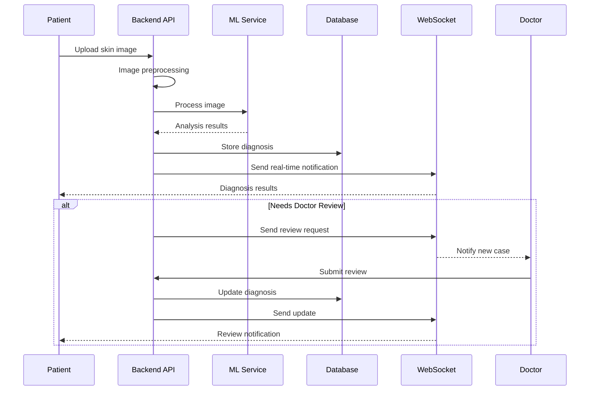
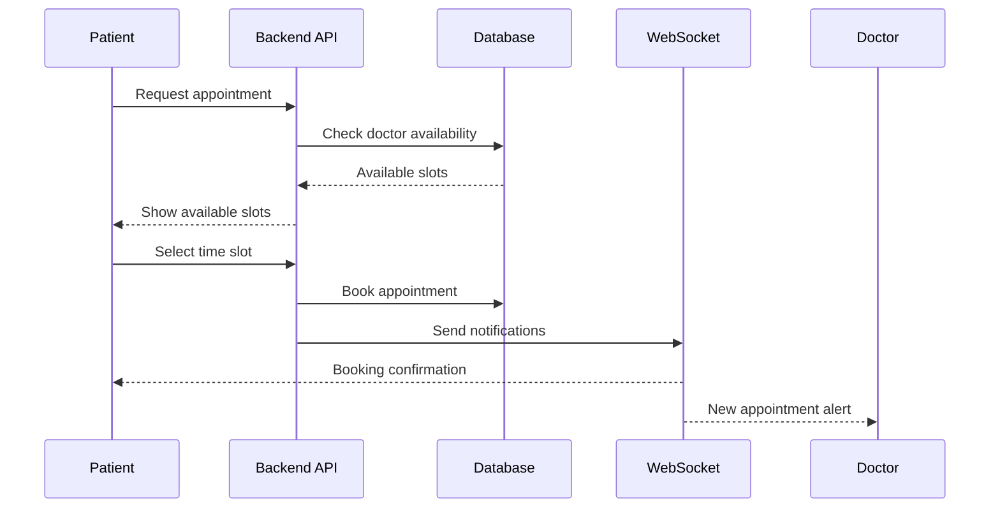
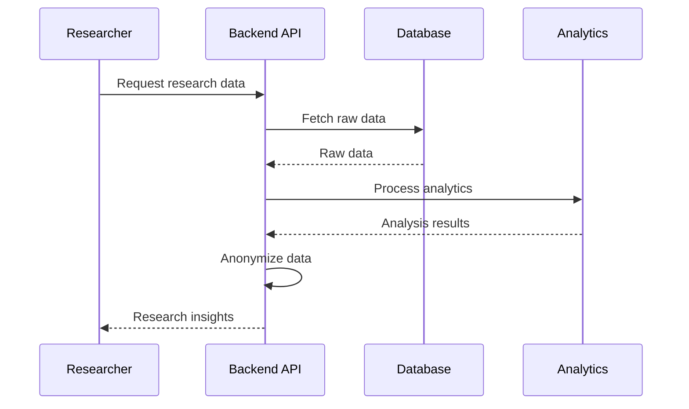
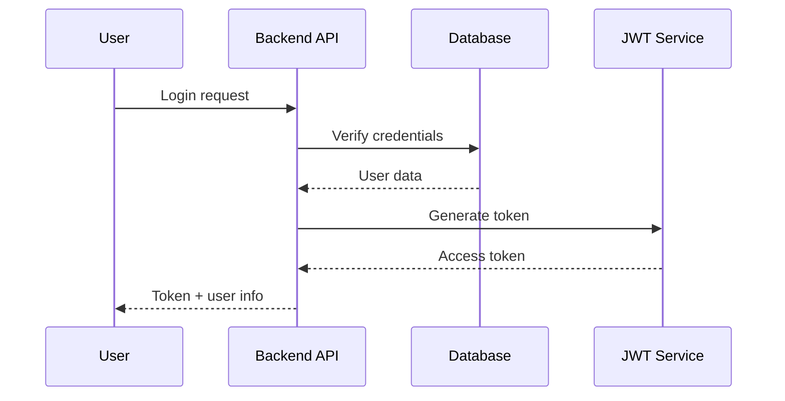
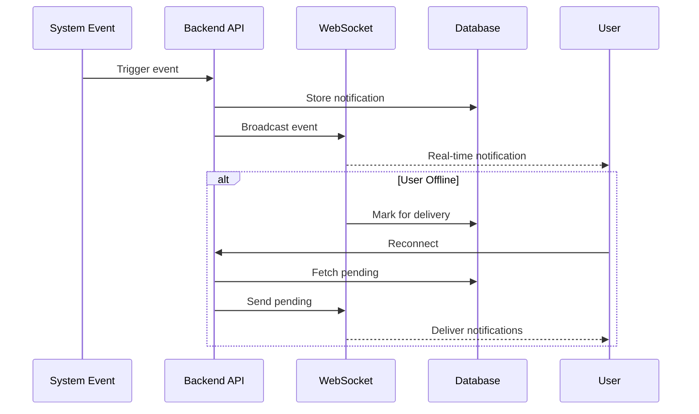

# Eczema Diagnosis System - Sequence Diagrams

## 1. Diagnosis Flow

```mermaid
sequenceDiagram
    participant P as Patient
    participant API as Backend API
    participant ML as ML Service
    participant DB as Database
    participant WS as WebSocket
    participant D as Doctor

    P->>API: Upload skin image
    API->>API: Image preprocessing
    API->>ML: Process image
    ML-->>API: Analysis results
    API->>DB: Store diagnosis
    API->>WS: Send real-time notification
    WS-->>P: Diagnosis results
    
    alt Needs Doctor Review
        API->>WS: Send review request
        WS-->>D: Notify new case
        D->>API: Submit review
        API->>DB: Update diagnosis
        API->>WS: Send update
        WS-->>P: Review notification
    end
```

## 2. Appointment Flow

```mermaid
sequenceDiagram
    participant P as Patient
    participant API as Backend API
    participant DB as Database
    participant WS as WebSocket
    participant D as Doctor

    P->>API: Request appointment
    API->>DB: Check doctor availability
    DB-->>API: Available slots
    API-->>P: Show available slots
    P->>API: Select time slot
    API->>DB: Book appointment
    API->>WS: Send notifications
    WS-->>P: Booking confirmation
    WS-->>D: New appointment alert
```

## 3. Research Data Flow

```mermaid
sequenceDiagram
    participant R as Researcher
    participant API as Backend API
    participant DB as Database
    participant AN as Analytics

    R->>API: Request research data
    API->>DB: Fetch raw data
    DB-->>API: Raw data
    API->>AN: Process analytics
    AN-->>API: Analysis results
    API->>API: Anonymize data
    API-->>R: Research insights
```

## 4. Authentication Flow

```mermaid
sequenceDiagram
    participant U as User
    participant API as Backend API
    participant DB as Database
    participant JWT as JWT Service

    U->>API: Login request
    API->>DB: Verify credentials
    DB-->>API: User data
    API->>JWT: Generate token
    JWT-->>API: Access token
    API-->>U: Token + user info
```

## 5. Real-time Notification Flow

```mermaid
sequenceDiagram
    participant S as System Event
    participant API as Backend API
    participant WS as WebSocket
    participant DB as Database
    participant U as User

    S->>API: Trigger event
    API->>DB: Store notification
    API->>WS: Broadcast event
    WS-->>U: Real-time notification
    
    alt User Offline
        WS->>DB: Mark for delivery
        U->>API: Reconnect
        API->>DB: Fetch pending
        API->>WS: Send pending
        WS-->>U: Deliver notifications
    end
```
